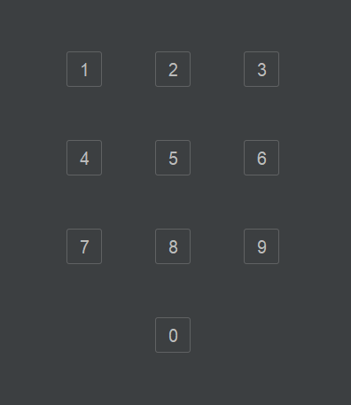
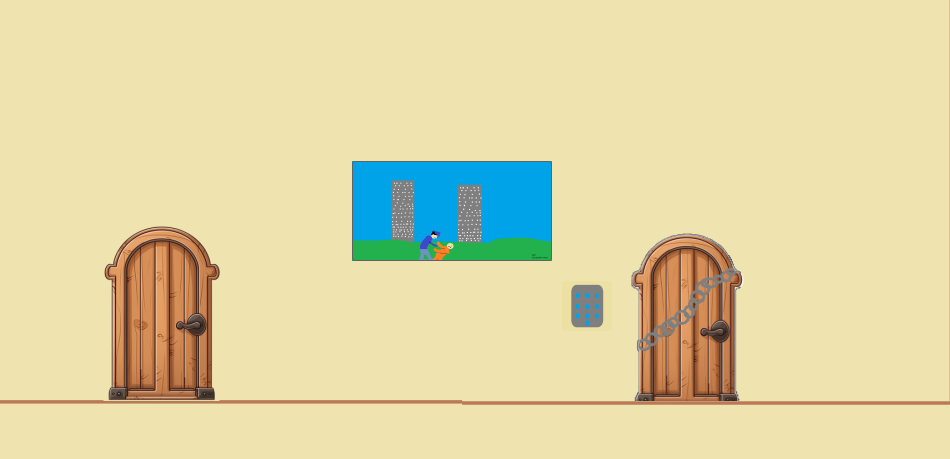

# Test Plan and Evidence / Results of Testing

## Game Descript

The project involves the programming of a game.
The project involves the programming of a game.

you are lost in Toms basement you need to get out before 
he finds you and dose unthinkable things
you will start in a room with one door when you leave its 
like an escape room were you need to 
find keys and get out before the time runs out

### Game Features and Rules

The game has the following features and/or rules:

- I said that you'll have to get out before Tom finds you but there will be no time limit as it's just a fun puzzle game 
- you will not be able to move on to the next room without completing a task and unlocking the door 
- there will be 8 room (the exit counts as a room) 
- you'll have to find passwords and put them in correct

---

## Test Plan

The following game features / functionality and player actions will need to be tested:

- that you cant get to the next rom without doing the code/ task in that room 
- that all the code work and all the doors open as expected 
- you go to the next room and do not skip
- all the buttons work and don't affect other buttons   
- you can leave
- I can get good-looking images that stick to the theam of the game  

The following tests will be run against the completed game. The tests should result in the expected outcomes shown.

### TEST NAME HERE

you go to the next room and do not skip

#### Test Data / Actions to Use

I will go back and forwards between room as fast as I could too see I skip any rooms

#### Expected Outcome

I wont skip any rooms
I didnt

### TEST NAME HERE

all my locks work as exspected 

#### Test Data / Actions to Use

I will put incorrect answers in to see if the door opens  

#### Expected Outcome

no doors will open if it's not the code I set 

### buttons

that all my buttons work and do as I want adn look right

#### Test Data / Actions to Use

I will press every button more than once and see they brake 

#### Expected Outcome

none of them will brake 

---

## Evidence / Results of Testing

### TEST of hole game

a video of my playing my game

https://mywaimeaschool-my.sharepoint.com/:v:/g/personal/jmace_waimea_school_nz/ERaJ6hdNMMZLtLXIyO7o-nkB2yHACbiqGYT1rKezckgY3g?nav=eyJyZWZlcnJhbEluZm8iOnsicmVmZXJyYWxBcHAiOiJTdHJlYW1XZWJBcHAiLCJyZWZlcnJhbFZpZXciOiJTaGFyZURpYWxvZy1MaW5rIiwicmVmZXJyYWxBcHBQbGF0Zm9ybSI6IldlYiIsInJlZmVycmFsTW9kZSI6InZpZXcifX0%3D&e=iwowry

####  Outcome

I got to the end with no trouble or errors

### buttons

ACTUAL RESULTS OF TESTING SHOWN HERE

they worked and look alright 

### that every thing was in a carton style or made in paint 

ACTUAL RESULTS OF TESTING SHOWN HERE

I made sure there were no wrong styles by making my owen photos 

they were ether good quality or bad because I suck at using paint 
